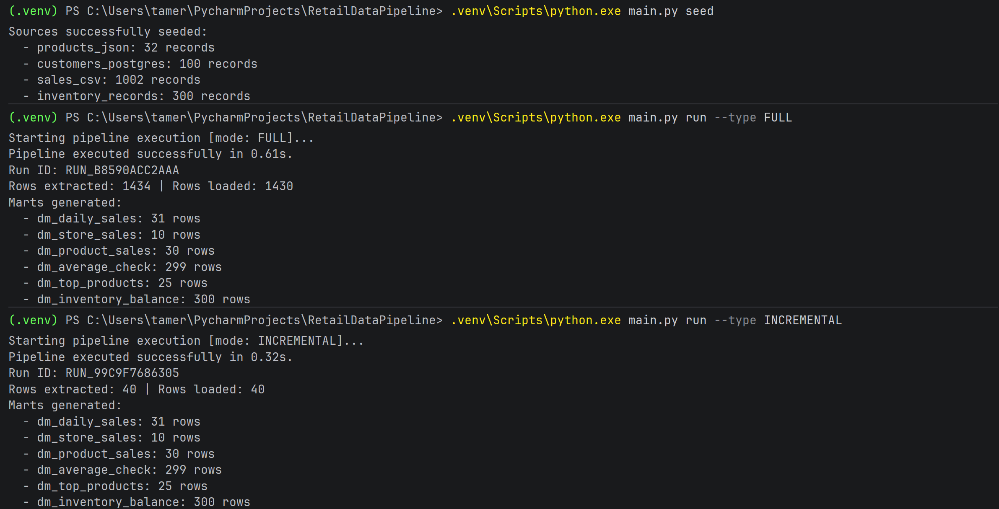
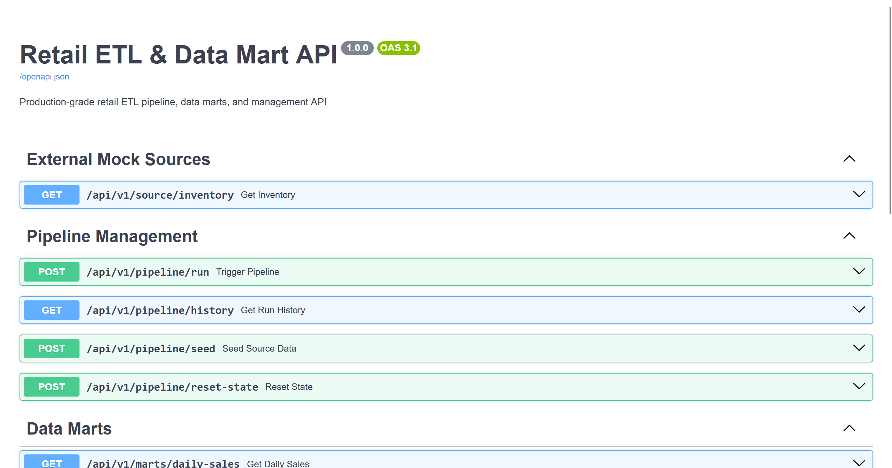

<div align="center">
  
  <h1>Retail ETL & Data Mart Pipeline</h1>
  <p><strong>Промышленный ETL-конвейер и аналитическое хранилище данных (DWH) для розничной торговли на Python, PostgreSQL, Pandas и FastAPI</strong></p>

  [](https://www.python.org/)
  [](https://fastapi.tiangolo.com/)
  [](https://www.postgresql.org/)
  [](https://pandas.pydata.org/)
  [](https://www.sqlalchemy.org/)
  [](https://www.docker.com/)
  [](https://pytest.org/)
  [](LICENSE)
</div>

---

## 📸 Интерфейс и демонстрация работы

### 1. Выполнение ETL-пайплайна и аудит загрузки в терминале
Оркестрация экстракции из 4 разнородных источников, очистка, дедупликация и автоматический пересчет аналитических витрин данных.

<p align="center">
  
</p>

### 2. Интерактивная среда и API-шлюз управления витринами
Управление инкрементальными запусками, отслеживание аудита в `core.pipeline_runs` и выгрузка готовых витрин через Swagger UI.

<p align="center">
  
</p>

---

## 💡 О проекте

**RetailDataPipeline** — это готовое к производственной эксплуатации решение для консолидации и анализа розничных данных. Система решает проблему фрагментации данных магазина: продажи хранятся в CSV-файлах кассовых терминалов, номенклатура товаров — в выгрузках JSON, клиентская база — во внешней CRM-системе (PostgreSQL), а складские остатки обновляются в реальном времени через внешний REST API.

ETL-конвейер забирает данные из всех 4 источников через единый абстрактный интерфейс с экспоненциальным retry, нормализует и очищает их с помощью векторизованных операций Pandas и валидации Pydantic, выполняет инкрементальную загрузку в хранилище данных PostgreSQL (схемы `staging` и `core`) и рассчитывает 6 оптимизированных аналитических витрин (схема `marts`).

---

## 🏛 Архитектура решения и слои данных

Проект спроектирован по многослойной DWH-архитектуре (Medallion Architecture: Staging / Core / Marts):

```
┌─────────────────────────────────────────────────────────────────────────────┐
│                                 ИСТОЧНИКИ                                   │
│  CSV (продажи)   JSON (товары)   PostgreSQL (клиенты)   REST API (остатки) │
└───────┬───────────────┬───────────────────┬────────────────────┬────────────┘
        │               │                   │                    │
        ▼               ▼                   ▼                    ▼
┌─────────────────────────────────────────────────────────────────────────────┐
│                      ЕДИНЫЙ СЛОЙ ЭКСТРАКЦИИ (Extractors)                     │
│               BaseExtractor -> Csv / Json / Postgres / Rest                 │
│              - Экспоненциальный retry при сбоях сети                        │
│              - Фильтрация дельты по чекпоинтам (Incremental Loading)        │
└─────────────────────────────────────┬───────────────────────────────────────┘
                                      ▼
┌─────────────────────────────────────────────────────────────────────────────┐
│                     ВАЛИДАЦИЯ И ОЧИСТКА (Transformers)                      │
│             - Pydantic контракты / Pandas & NumPy векторизация              │
│             - Дедупликация по бизнес-ключам (сохранение latest)             │
│             - Очистка NULL, отсеивание аномалий (qty <= 0, price <= 0)      │
│             - Нормализация строк, email, категорий и дат                    │
└─────────────────────────────────────┬───────────────────────────────────────┘
                                      ▼
┌─────────────────────────────────────────────────────────────────────────────┐
│                           POSTGRESQL DWH (Слои)                             │
│                                                                             │
│  [staging]  stg_sales, stg_products, stg_customers, stg_inventory           │
│      │                                                                      │
│      ▼ (Идемпотентный UPSERT / ON CONFLICT DO UPDATE)                       │
│  [core]     dim_customers, dim_products, dim_stores                         │
│             fct_sales, fct_inventory_snapshots                              │
│             pipeline_runs, pipeline_state (Metadata & State)                │
│      │                                                                      │
│      ▼ (Аналитический SQL: CTE, Window Functions, JOIN)                     │
│  [marts]    dm_daily_sales, dm_store_sales, dm_product_sales                │
│             dm_average_check, dm_top_products, dm_inventory_balance         │
└─────────────────────────────────────┬───────────────────────────────────────┘
                                      ▼
┌─────────────────────────────────────────────────────────────────────────────┐
│                           ИНТЕРФЕЙСЫ ДОСТУПА                                │
│       CLI (argparse)        │         FastAPI (/api/v1/*)                   │
│  main.py run / seed / etc.  │  marts / pipeline triggers / mock source      │
└─────────────────────────────────────────────────────────────────────────────┘
```

---

## 📊 Аналитические витрины данных (SQL & Window Functions)

В схеме `marts` создаются 6 витрин данных, построенных на аналитическом SQL с использованием CTE, JOIN и оконных функций:

| Витрина | Назначение | Использованные SQL-конструкции |
|---|---|---|
| **`marts.dm_daily_sales`** | Динамика выручки, чеков и клиентов по дням | `SUM() OVER(PARTITION BY DATE_TRUNC('month', sale_date) ORDER BY sale_date)` (нарастающий итог месяца), `LAG()` (выручка предыдущего дня), расчет темпа прироста день-к-дню (`dod_growth_pct`). |
| **`marts.dm_store_sales`** | Эффективность торговых точек сети | `DENSE_RANK() OVER(ORDER BY total_revenue DESC)` (рейтинг магазина), `100.0 * total_revenue / SUM(total_revenue) OVER()` (доля точки в совокупной выручке сети). |
| **`marts.dm_product_sales`** | Продажи, себестоимость и маржинальность | `DENSE_RANK() OVER(PARTITION BY category ORDER BY total_revenue DESC)` (ранг товара в категории), расчет доли выручки в категории. |
| **`marts.dm_average_check`** | Анализ размера чека по магазинам и датам | `CTE (order_totals)` для агрегации корзины, `AVG() OVER(PARTITION BY store_id)` (средний чек по точке), расчет отклонения дневного чека от среднего. |
| **`marts.dm_top_products`** | Топ-5 товаров в каждой категории | `CTE + ROW_NUMBER() OVER(PARTITION BY category ORDER BY total_revenue DESC)` с фильтрацией `WHERE rank_in_category <= 5`. |
| **`marts.dm_inventory_balance`** | Скорость продаж и статус складских запасов | `DISTINCT ON` по последней ревизии склада, `CTE` скорости продаж за 30 дней, расчет дней запаса, классификация статусов (`OUT_OF_STOCK`, `CRITICAL_LOW`, `OPTIMAL`, `OVERSTOCK`), `RANK() OVER(...)`. |

### Оптимизация и индексы
- B-Tree индексы на фактах: `core.fct_sales(sale_date)`, `core.fct_sales(store_id, sale_date)`, `core.fct_sales(product_id)`, `core.fct_sales(customer_id)`.
- Индексы на витринах для ускорения фильтрации и ранжирования: `marts.dm_daily_sales(sale_date)`, `marts.dm_store_sales(revenue_rank)`, `marts.dm_top_products(category, rank_in_category)`, `marts.dm_inventory_balance(stock_status)`.

---

## 🛠 Стек технологий

| Категория | Технологии |
|---|---|
| **Язык и среда** | Python 3.12, Linux / Windows |
| **Обработка данных** | Pandas 3.0+, NumPy 2.0+ (векторизованная очистка и трансформация) |
| **База данных и DWH** | PostgreSQL 16 (схемы `staging`, `core`, `marts`, `source_crm`) |
| **ORM и SQL Engine** | SQLAlchemy 2.0+, Psycopg2-binary |
| **Web API и Контракты** | FastAPI, Pydantic 2.0+, Pydantic-Settings, Uvicorn, Httpx |
| **Тестирование** | Pytest (20 модульных и интеграционных тестов) |
| **Контейнеризация и CI** | Docker, Docker Compose, GitHub Actions |

---

## 📁 Структура репозитория

```
RetailDataPipeline/
├── .github/
│   └── workflows/ci.yml       # Непрерывная интеграция GitHub Actions (CI)
├── docs/
│   └── images/                # Логотип и скриншоты проекта
│       ├── logo.png
│       ├── screenshot_1.png
│       └── screenshot_2.png
├── data/
│   └── raw/                   # Локальные файлы источников (sales.csv, products.json)
├── src/
│   ├── api/                   # FastAPI веб-сервер и маршрутизация
│   │   ├── routes/            # Эндпоинты источника остатков, пайплайна и витрин
│   │   └── app.py
│   ├── extractors/            # Единый слой извлечения (BaseExtractor, Csv, Json, Postgres, Rest)
│   ├── loaders/               # Загрузка в staging и идемпотентный UPSERT в core
│   ├── marts/                 # Построение витрин (SQL с оконными функциями и CTE)
│   ├── models/                # Pydantic-контракты и SQLAlchemy ORM-модели
│   ├── services/              # PipelineService, StateService, SeederService
│   ├── transformers/          # Очистка, валидация и дедупликация
│   ├── config.py              # Конфигурация (.env)
│   └── database.py            # Движок БД и инициализация схем
├── tests/                     # 20 автоматических тестов (Pytest)
├── docker-compose.yml         # Манифест Docker Compose (PostgreSQL + App)
├── Dockerfile                 # Multi-stage production образ приложения
├── requirements.txt           # Зависимости проекта
├── pyproject.toml             # Конфигурация инструментов
├── LICENSE                    # Лицензия MIT
├── main.py                    # Единая точка входа CLI и сервера
└── README.md                  # Документация проекта
```

---

## 🚀 Быстрый старт

### Вариант 1: Запуск через Docker Compose (Рекомендуемый)

```bash
# Клонирование репозитория
git clone https://github.com/tamer/RetailDataPipeline.git
cd RetailDataPipeline

# Запуск базы данных и сервиса
docker compose up -d

# Наполнение источников реалистичными данными
docker compose exec app python main.py seed

# Запуск полного ETL-пайплайна
docker compose exec app python main.py run --type FULL

# Запуск набора тестов
docker compose exec app pytest -v
```

Интерактивная документация Swagger UI доступна по адресу: **http://localhost:8000/docs**

---

### Вариант 2: Локальный запуск (Windows / Linux)

1. **Запустите PostgreSQL**:
```bash
docker compose up -d postgres
```

2. **Создайте и активируйте виртуальное окружение**:
```bash
# Windows
python -m venv .venv
.venv\Scripts\activate

# Linux / MacOS
python3 -m venv .venv
source .venv/bin/activate
```

3. **Установите зависимости**:
```bash
pip install -r requirements.txt
```

4. **Сгенерируйте данные во всех 4 источниках**:
```bash
python main.py seed
```

5. **Выполните пайплайн**:
```bash
# Полная загрузка:
python main.py run --type FULL

# Инкрементальная загрузка (только изменения):
python main.py run --type INCREMENTAL
```

6. **Посмотрите журнал аудита запусков**:
```bash
python main.py history --limit 10
```

7. **Запустите API-сервер**:
```bash
python main.py serve
```

8. **Запустите автотесты**:
```bash
pytest -v
```

---

## 🎯 Архитектурные решения («Почему так, а не иначе»)

1. **Разделение на схемы (`source_crm`, `staging`, `core`, `marts`)**:
   - В отличие от плоской структуры в `public`, разделение изолирует сырые данные от аналитических витрин. Staging можно безопасно очищать перед каждым батчем, а слой `core` обеспечивает целостность нормализованных данных.
2. **Единый базовый класс `BaseExtractor`**:
   - Обеспечивает расширяемость по принципу Open/Closed (SOLID). Добавление любого нового источника данных (S3, Kafka, Google BigQuery) не требует правок в логике оркестратора.
3. **Идемпотентность (`ON CONFLICT DO UPDATE`)**:
   - Защищает хранилище от дублирования записей при повторных или аварийно прерванных запусках.
4. **Инкрементальные чекпоинты (`core.pipeline_state`)**:
   - При регулярном расписании конвейер обрабатывает только дельту с момента последнего успешного извлечения (`updated_at > checkpoint`), что экономит сетевые и вычислительные ресурсы.
5. **Сохранение телеметрии каждого запуска (`core.pipeline_runs`)**:
   - Фиксация числа извлеченных, загруженных, отброшенных и дедуплицированных строк обеспечивает прозрачный аудит качества данных (Data Quality).
6. **FastAPI как шлюз и Mock-источник**:
   - Сервис совмещает отдачу внешних данных по остаткам и аналитический API для витрин, что позволяет запускать и тестировать весь комплекс автономно без внешних зависимостей.

---

## 📄 Лицензия

Проект распространяется под лицензией [MIT](LICENSE).
